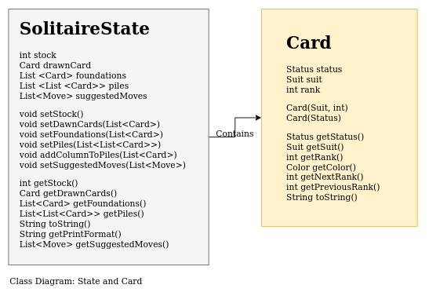

# Data Objects

## Summary
Cards are created like this ```new Card(Card.Suit.SPADE, 12)``` or like this: ```new Card(Card.Status.FACEDOWN)```.
SolitaireState has four fields with setters and getters. 
1. ```boolean stockEmpty```
2. ```List<Card> drawnCards```
3. ```List<Card> foundations```
4. ```List<List<Card>> piles```

## Card
This object represents a card in the game. 

|Field|Type|Use|
|---|---|---|
|status|enum Status|Indicates wether a card is face down or face up.|
|suit|enum Suit|Spade, Heart, Diamond or Club|
|rank|int (1-13)|11 = jack, 12 = Queen, 13 = king, 1 = ace|

#### Constructors
The constructor is overloaded, so two versions exist: One for visible cards, and one for cards that are lying face down. 


Visible cards are created like this:
```
new Card(Card.Suit.SPADE, 12)
```
The suits belong to a static enum in the Card class. Legal ranks are 1 through 13.

Cards lying face down are created like this:
```
new Card(Card.Status.FACEDOWN)
```
Status is a static enum in the Card class, just like suit. The default value of the status field is Status.FACEUP, which is why it must be specified in the constructor.

#### Checking status
Before you ask for a cards suit or rank, it's a good idea to check if Status is set to FACEUP.
```
if (someCard.getStatus() == Card.Status.FACEUP{
    // Use card
} 
```
#### Suit vs. Color
Cards have suits. Suits come in two colors, red and black. To get the color of a card, call ```getColor()```.


## SolitaireState

### Class diagram


This object is used to store the whole deck of cards as displayed on the table. All the following fields must be set:

| Field | Type | Use |
|---|---|---|
| stockEmpty | boolean | To check if there are cards left to draw.
| drawnCards | List of Cards. Max size: 3. | The 0-3 cards currently drawn. |
| foundations | List of Cards. Max size: 3.| Goal for the sorted cards. Values can be null|
| piles | List of Lists of Cards. Size: 7. | The 7 columns. Values can be empty lists.|

There are getters and setters for all fields. Some basic tests for validity are built-in. Some null values will raise exceptions, and the size ranges are enforced. (There is an extra setter for individual 'rows' in the pile, in case that is more practical)

The `toString()` method returns the ID of the SolitaireState. 

To get a printable String showing the State, call `getPrintFormat()`.


## Move

The I_Logic interface returns a list containing Move objects that represents valid moves for a SolitaireState object.

|Field|Type|Use|
|---|---|---|
|moveType|enum MoveType|Type of move: FACEUP, MOVE (from pile), DRAW (from draw/stock)|
|position|int[]|The position of moveType: E.g. MoveType is MOVE then position[1,0] corresponds to pile row 2, card in front. 
|destinationType|enum DestinationType|Stack to move to: PILE, FOUNDATION|
|destPosition|int|Moving position. E.g. Type is FOUNDATION, then destPosition(0) corresponds to foundation-pile 1.|

>Author:  Erlend