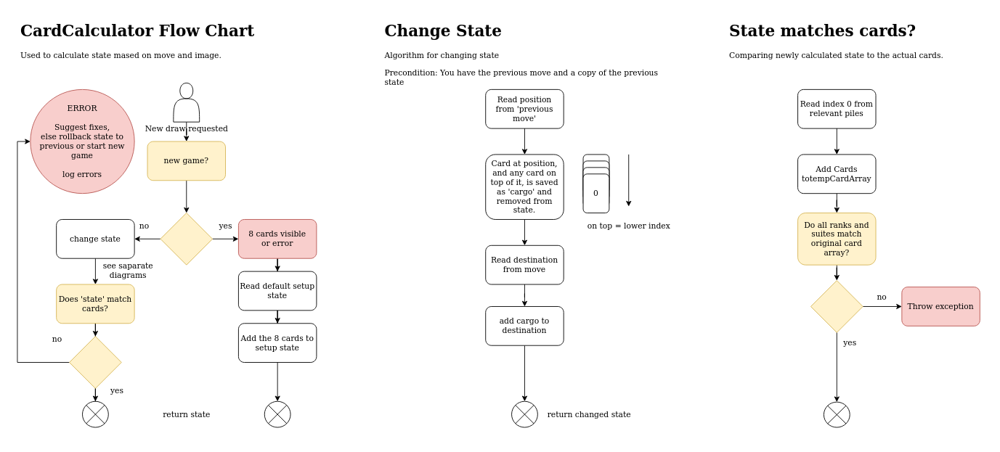

# Card Calculator

Calculates NEXT state based on the move.

###Input
1. Image state from Computer Vision, array
2. Previous state
3. Previous move 

### Output
2. Returns state to caller
3. Errors 

If no previous state or previous move is given, it generates a new one based on a starter state and assumes this is a new game.

Card array is a required argument, move and state is required except in new game.

Suggested classes and methods:

```
class CardCalculator
Solitairestate updateState(List<Card> cardArray, State prevState, Move move)
Solitairestate initiateState(List<Card> cardArray)
```

## Flow Chart


