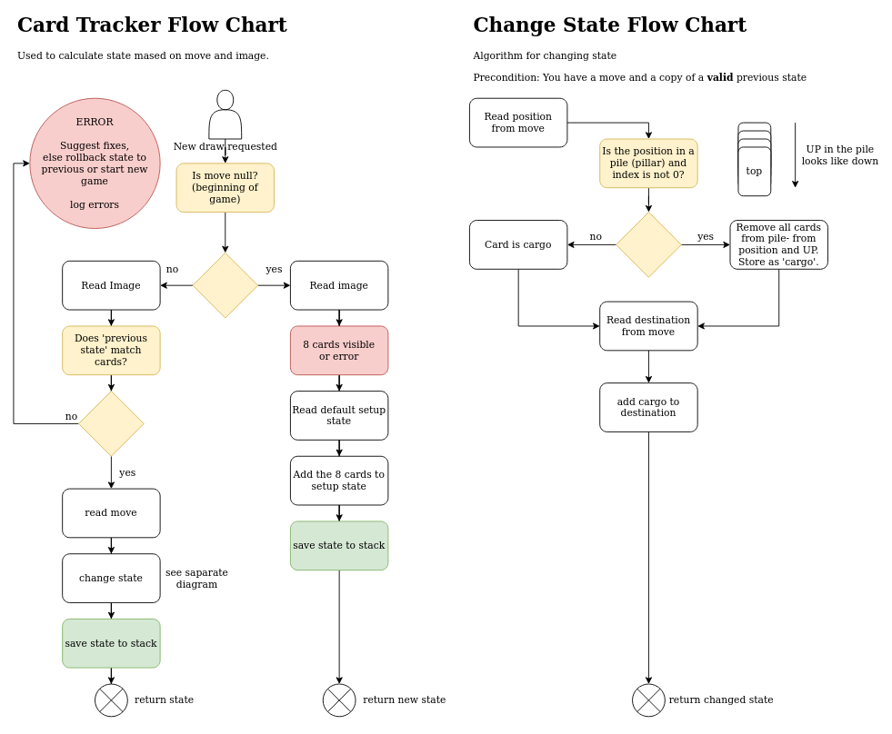

# Card Tracker

Card tracker keeps track of state.

###Input
1. Image state from Computer Vision, array
2. Previous state
3. Move. 

### Output
1. Saves state
2. Returns state to controller.
3. Errors 

If no previous state or move are given, it generates a new one based on a starter state and assumes this is a new game.

Card array is a required argument, move and state is required except in new game.

Maybe this class should leave saving to disk to the controller...

Suggested classes and methods:

```
class CardTracker
Solitairestate generateState(List<Card> cardArray, State prevState, Move move)
Solitairestate generateState(List<Card> cardArray)
```

## Flow Chart


First draft for card tracker.