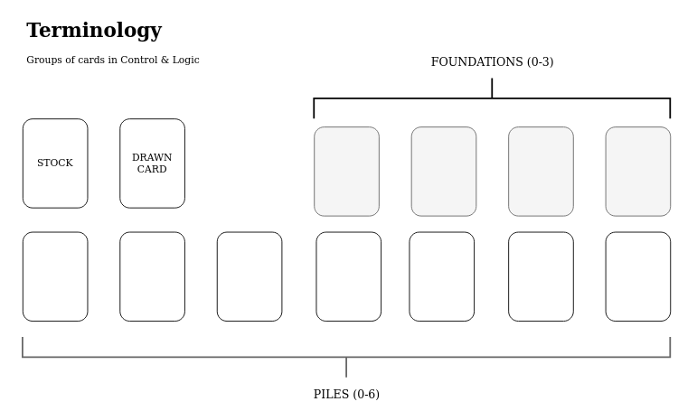

# logic.Logic

## Summary

logic.Logic implements interface logic.I_Logic 

### Implementation
```
@Override
public List<Move> getMoves(SolitaireState state)
```

Takes an SolitaireState object as argument and returns a prioritized list of possible moves.

One outer loop iterates pile 1 to 7 in the state-object and an inner loop checks for possible moves for any given card in the pile.

Valid moves:
* Moving card to foundation - only for card at index ```size() - 1```.
* Moving one or more cards from pile to another pile.
* Turn card (FACEUP) - only for card at index ```size() - 1```.
* Moving drawn card to pile.

Where size() is the array size of a particular pile.

Last the drawn/stock card is checked against the four foundation piles.



>Author: Anders